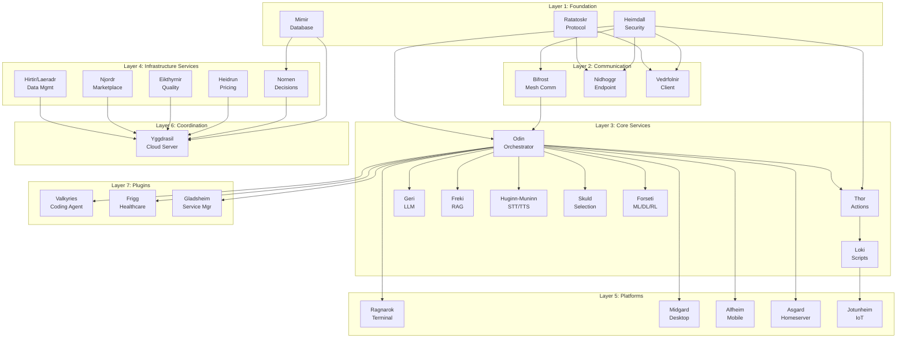

# Edda Master Implementation Plan

## Executive Summary

Edda comprises 30+ microservices/platforms organized into Core Services, Infrastructure, Platforms, and Supporting Services. This master plan tracks implementation status, dependencies, and defines the critical path for development.

**Current System Status:** ~25% complete

- 3 projects complete (Odin, Ratatoskr, Nornen ✅)
- 3 projects mostly complete (Bifrost ~85%, Heimdall ~90%, Nidhoggr ~85%)
- 5 projects in progress (Mimir ~90%, Thor ~55%, Geri ~25%, Freki ~42%, Skuld ~65%, Ragnarok ~35%)
- 19+ projects not started

## Architecture Overview

## Implementation Layers

### Layer 1: Foundation (No Dependencies)

Critical foundation services that others depend on. Must be implemented first.

**Projects:** Heimdall (Security), Ratatoskr (Protocol), Mimir (Database)

**Rationale:** These services have minimal dependencies and are required by multiple other services. Heimdall provides authentication/authorization, Ratatoskr defines the business protocol, and Mimir provides privacy-focused data storage.

### Layer 2: Communication (Depends on Layer 1)

Communication infrastructure enabling device-to-device and device-to-cloud connections.

**Projects:** Bifrost (Device Mesh), Nidhoggr (Cloud Endpoint), Vedrfolnir (Connection Client)

**Rationale:** Bifrost depends on Heimdall for security. Nidhoggr and Vedrfolnir depend on both Ratatoskr (protocol) and Heimdall (authentication).

### Layer 3: Core Services (Depends on Layers 1-2)

Main AI services providing orchestration, actions, LLM, RAG, STT/TTS, and ML capabilities.

**Projects:** Odin (Orchestrator), Thor (Actions), Geri (LLM), Freki (RAG), Huginn-Muninn (STT/TTS), Skuld (LLM Selection), Loki (Scripts), Forseti (ML/DL/RL)

**Rationale:** Odin is already complete. Thor, Geri, Freki, and others provide core AI functionality. Loki enables script execution for IoT devices.

### Layer 4: Infrastructure Services (Depends on Layers 1-3)

Cloud-based infrastructure services for decision routing, pricing, quality assessment, and marketplace.

**Projects:** Nornen (Decision Routing), Heidrun (Token/Pricing), Eikthyrnir (Quality Assessment), Njordr (Marketplace), Hirtir/Laeradr (Consolidated Data Management)

**Rationale:** These services coordinate cloud operations and depend on Mimir for storage, Nornen for routing, and other microservices.

### Layer 5: Platforms (Depends on Layers 1-4)

User-facing platforms that integrate core services for different device types.

**Projects:** Ragnarok (Terminal), Midgard (Desktop), Alfheim (Mobile), Asgard (Homeserver), Jotunheim (IoT)

**Rationale:** Platforms are integration layers that call core services via gRPC. They require Odin (orchestration), Thor (actions), and other core services to function.

### Layer 6: Cloud Coordination (Depends on All Layers)

Central cloud server coordinating all microservices and providing user management.

**Projects:** Yggdrasil (Cloud Server)

**Rationale:** Yggdrasil coordinates all infrastructure microservices (Nornen, Heidrun, Eikthyrnir, Njordr, Nidhoggr, Hirtir/Laeradr) and requires them to be implemented first.

### Layer 7: Plugins & Extensions (Depends on Core)

Specialized plugins providing domain-specific functionality.

**Projects:** Valkyries (Coding Agent), Frigg (Healthcare), Gladsheim (Service Manager)

**Rationale:** Plugins depend on Odin for orchestration and Thor for action execution. Can be implemented after core services are stable.

## Critical Path Analysis

**Blocking Projects:** These must be prioritized as they block multiple others:

1. **Heimdall** (mostly complete) - blocks Bifrost, Thor, Nidhoggr, Vedrfolnir, Asgard
2. **Ratatoskr** (not started) - blocks Nidhoggr, Vedrfolnir, Yggdrasil integration
3. **Mimir** (not started) - blocks Nornen, Hirtir/Laeradr, Yggdrasil

**High-Priority Completions:**

- Complete Thor (in progress) - blocks Loki and all platforms
- Complete Geri (in progress) - blocks Forseti
- Complete Skuld (in progress) - needed for intelligent model selection

## Project Status Matrix

| Project        | Status          | Progress | Dependencies                  | Blocks                              | Layer |
| -------------- | --------------- | -------- | ----------------------------- | ----------------------------------- | ----- |
| Heimdall       | Mostly Complete | 90%      | -                             | Bifrost, Thor, Nidhoggr, Vedrfolnir | 1     |
| Ratatoskr      | Complete        | 100%     | -                             | Nidhoggr, Vedrfolnir                | 1     |
| Mimir          | In Progress     | 90%      | -                             | Nornen, Yggdrasil                   | 1     |
| Bifrost        | Mostly Complete | 85%      | Heimdall                      | Odin, Platforms                     | 2     |
| Nidhoggr       | Mostly Complete | 85%      | Ratatoskr, Heimdall           | Yggdrasil                           | 2     |
| Vedrfolnir     | Mostly Complete | 85%      | Ratatoskr, Heimdall           | Platforms                           | 2     |
| Odin           | Complete        | 100%     | Bifrost, Heimdall             | All Platforms, Plugins              | 3     |
| Thor           | In Progress     | 55%      | Odin, Heimdall                | Loki, Platforms, Forseti            | 3     |
| Geri           | In Progress     | 25%      | Odin                          | Forseti, Platforms                  | 3     |
| Freki          | In Progress     | 54%      | Odin                          | Platforms, Forseti                  | 3     |
| Huginn-Muninn  | Not Started     | 5%       | Odin                          | Platforms                           | 3     |
| Skuld          | In Progress     | 65%      | Odin                          | Platforms                           | 3     |
| Loki           | Not Started     | 5%       | Thor                          | Jotunheim                           | 3     |
| Forseti        | Not Started     | 5%       | Odin, Geri, Thor, Freki       | Plugins                             | 3     |
| Nornen         | Complete        | 100%     | Mimir                         | Yggdrasil, Infrastructure           | 4     |
| Heidrun        | Not Started     | 0%       | Yggdrasil                     | Njordr, Eikthyrnir                  | 4     |
| Eikthyrnir     | Not Started     | 0%       | Yggdrasil                     | Njordr                              | 4     |
| Njordr         | Not Started     | 0%       | Heidrun, Eikthyrnir, Nornen   | Yggdrasil                           | 4     |
| Hirtir/Laeradr | Not Started     | 0%       | Mimir, Nornen                 | Yggdrasil                           | 4     |
| Ragnarok       | In Progress     | 35%      | Odin, Thor, Core Services     | -                                   | 5     |
| Midgard        | Not Started     | 5%       | Odin, Thor, Core Services     | -                                   | 5     |
| Alfheim        | Not Started     | 5%       | Odin, Thor, Core Services     | -                                   | 5     |
| Asgard         | Not Started     | 5%       | Odin, Heimdall, Core Services | -                                   | 5     |
| Jotunheim      | Not Started     | 5%       | Loki                          | -                                   | 5     |
| Yggdrasil      | Not Started     | 0%       | All Infrastructure            | -                                   | 6     |
| Valkyries      | Not Started     | 0%       | Odin, Thor, Geri              | -                                   | 7     |
| Frigg          | Not Started     | 0%       | Odin, Thor, Yggdrasil         | -                                   | 7     |
| Gladsheim      | Not Started     | 0%       | Odin, Heimdall                | -                                   | 7     |

## Key Technical Decisions Required

### Immediate Decisions

1. **Hirtir/Laeradr Consolidation:** DECISION MADE - Consolidate into single project
2. **Gladsheim Technical Choices:** Mark as "to be decided" - gRPC framework, health check strategy, process management

### Open Questions in Projects

- **Bifrost:** WebSocket library, TLS library, mDNS library, NAT traversal libraries (6 questions)
- **Heimdall:** Protobuf tool, Database, Crypto library, Token expiration, OAuth providers (5 questions)
- **Skuld:** Protobuf tool, Database (2 questions)
- **Loki:** Protobuf tool, Script engine, Config format, Script storage (4 questions)
- **Asgard:** Database choice, Web dashboard, API framework, NAT-Traversal libraries (4 questions)

## Implementation Todos by Layer

Detailed project-specific todos are maintained in each project's `IMPLEMENTATION_PLAN.md`. The master plan tracks layer-level completion and cross-project dependencies.

### Layer 1: Foundation

- [x] **Heimdall** - ✅ Phase 14 (Encryption & TLS), Phase 15 (Performance), Phase 17 (Security-Dokumentation) complete. Remaining: Optional phases (Email/Code-Verification, OAuth Integration). Currently ~90% complete.
- [x] **Ratatoskr** - ✅ COMPLETE - WebSocket protocol fully implemented (all 8 phases, 73 steps). Ready for Nidhoggr and Vedrfolnir integration.
- [ ] **Mimir** - Phase 1-6, 8.1.2, 8.2, 9.1.1, 9.2.1, 9.3.1, 10.1.1 (Logging), 10.2.1, Phase 11 (Documentation) ✅, Phase 12 (E2E, Performance-Basis, Security: Injection-Tests) ✅ teilweise (~90%). Remaining: Phase 12 optional (Load/Stress, Data-Leak, Key-Management). CRITICAL BLOCKER for Nornen and Yggdrasil.

### Layer 2: Communication

- [ ] **Bifrost** - Phase 8.1 (mDNS/Bonjour) ✅, Phase 13 (NAT Traversal: STUN, TURN Client, ICE Manager, Port-Forwarding Fallback) ✅ complete (Stubs). Remaining: Phase 13.2.2 (TURN Server optional), resolve 6 open technical questions. Currently ~85% complete.
- [x] **Nidhoggr** - ✅ Phase 1-7, 9 complete (85%). Remaining: Performance benchmarks, Performance tests. Depends on Ratatoskr ✅ and Heimdall ✅.
- [x] **Vedrfolnir** - ✅ Phase 1-8, 9 teilweise, 10 teilweise complete (~80%). Remaining: Heimdall-Integration, Performance-Tests. Depends on Ratatoskr ✅ and Heimdall ✅.

### Layer 3: Core Services

- [ ] **Thor** - Phase 2–11, 13.1+13.5, 14 ✅, Phase 15 (Docs/Security-Test) teilweise ✅. Remaining: Phase 12 (UI-Automation), 13.2–13.4 (optional), 14.2 (Device-Registry optional), Phase 15 Performance/Odin-Integration optional. Currently ~55% complete.
- [ ] **Geri** - Phase 1.1.2 (Struktur) ✅, Phase 1.2.3 (CI/CD) ✅, Phase 1.3 (Settings-Schema, Validierung, Loader, Hot-Reload) ✅. Remaining: Phase 1.2.1–1.2.2, Phase 2–20. Currently ~20% complete.
- [ ] **Freki** - Phase 1.1–1.2.1, 2–9, 13–17, 18.1.1 (gRPC-API-Dokumentation), 18.3.1, 19.1–19.3 ✅; Phase 7 (Change-Detection, Incremental-, Full-Re-Indexing) ✅; Phase 8.1 (Watch-Folder-Manager, Auto-Indexing-Manager) ✅. Remaining: Phase 10–12, 16.2–16.3, 18.2 (Rustdoc, Architecture-Diagramme). Currently ~53% complete.
- [ ] **Huginn-Muninn** - Implement STT/TTS service (Audio Processing, STT/TTS Engines, Media Forwarding). Depends on Odin.
- [ ] **Skuld** - Phase 1–9 (Eikthyrnir-Client, Cache, Query-Optimization, Dokumentation, E2E-, Performance-Tests) ✅. Remaining: Phase 2 (Geri gRPC-Client). Currently ~65% complete.
- [ ] **Loki** - Implement script execution service (Script Engine, Resource Management, Fenrir/Jörmungandr/Hel). Depends on Thor. Resolve 4 open questions.
- [ ] **Forseti** - Implement ML/DL/RL service (PyTorch/TensorFlow, Rust-native ML, RL Engine, Model Management). Depends on Odin, Geri, Thor, Freki.

### Layer 4: Infrastructure Services

- [x] **Nornen** - ✅ COMPLETE - All 8 phases implemented (Provider Registry, Request Routing, Coordination, Performance Optimization, Security & Monitoring, Documentation & Testing). Ready for Yggdrasil integration.
- [ ] **Heidrun** - Implement token/pricing service (Token Counting, Pricing, Settlement, Pre-Authorization). Depends on Yggdrasil.
- [ ] **Eikthyrnir** - Implement quality assessment service (Quality Metrics, Aggregation, Periodic Tests). Depends on Yggdrasil.
- [ ] **Njordr** - Implement marketplace service (Provider Management, Fair Distribution, Transaction Management). Depends on Heidrun, Eikthyrnir, Nornen.
- [ ] **Hirtir/Laeradr** - Consolidate into single Data Management Service. Implement Dáinn (Indexing), Dvalinn (Validation), Duneyrr (Aggregation), Duraþrór (Retention). Depends on Mimir, Nornen.

### Layer 5: Platforms

- [ ] **Ragnarok** - Phase 2 (Odin-Proto+Client) ✅, Phase 3 (CLI) ✅, Phase 4 (Odin-Service-Integration) ✅, Phase 8 (README Usage) ✅ teilweise. Remaining: Phase 5-7 (TUI, Service-Discovery, Security). Currently ~35% complete.
- [ ] **Midgard** - Implement desktop platform (200+ steps across 16 phases). Depends on Odin, Thor, Geri, Freki, Huginn-Muninn, Bifrost.
- [ ] **Alfheim** - Implement mobile platform (200+ steps across 18 phases). Depends on Odin, Thor, Geri, Freki, Huginn-Muninn, Bifrost.
- [ ] **Asgard** - Implement homeserver platform (400+ steps across 22 phases). Resolve database and API framework decisions. Depends on Odin, Heimdall, Bifrost.
- [ ] **Jotunheim** - Implement IoT platform (200+ steps across 13 phases). Depends on Loki service.

### Layer 6: Cloud Coordination

- [ ] **Yggdrasil** - Implement cloud server coordinator (135 steps across 12 phases). Depends on Nornen, Heidrun, Eikthyrnir, Njordr, Nidhoggr, Hirtir/Laeradr, Mimir.

### Layer 7: Plugins & Extensions

- [ ] **Valkyries** - Implement coding agent plugin (81 steps across 9 phases). Depends on Odin, Thor, Geri.
- [ ] **Frigg** - Implement healthcare plugin (250+ steps across 18 phases). Depends on Odin, Thor, Yggdrasil. Requires isolated PostgreSQL database.
- [ ] **Gladsheim** - Implement service manager (Thjalfi, Byggvir, Roskva, Skirnir). Resolve 3 open technical questions. Depends on Odin, Heimdall.

### Cross-Project Tasks

- [ ] Ensure all project `IMPLEMENTATION_PLAN.md` files have todos for remaining tasks. Add todos to projects missing them (focus on unchecked tasks only).
- [ ] Resolve open technical questions across projects: Bifrost (6 questions), Heimdall (5 questions), Skuld (2 questions), Loki (4 questions), Asgard (4 questions), Gladsheim (3 questions).

## Recommended Implementation Order

Based on the dependency analysis, here is the recommended implementation sequence:

**Phase 1: Complete Foundation (Months 1-2)**
1. Complete Heimdall (finish remaining 15%)
2. Implement Ratatoskr (protocol definition)
3. Implement Mimir (database service)

**Phase 2: Complete Communication (Months 2-3)**
4. Complete Bifrost (finish remaining 20%)
5. Implement Nidhoggr (cloud endpoint)
6. Implement Vedrfolnir (connection client)

**Phase 3: Complete Core Services (Months 3-6)**
7. Complete Thor (finish remaining 80%)
8. Complete Geri (finish remaining 85%)
9. Complete Skuld (finish remaining 85%)
10. Implement Freki (RAG service)
11. Implement Huginn-Muninn (STT/TTS)
12. Implement Loki (script execution)
13. Implement Forseti (ML/DL/RL)

**Phase 4: Infrastructure Services (Months 6-8)**
14. ✅ Nornen - COMPLETE
15. Implement Hirtir/Laeradr (consolidated data management)
16. Implement Heidrun (pricing service)
17. Implement Eikthyrnir (quality assessment)
18. Implement Njordr (marketplace)

**Phase 5: Platforms (Months 8-11)**
19. Complete Ragnarok (finish remaining 85%)
20. Implement Midgard (desktop)
21. Implement Alfheim (mobile)
22. Implement Asgard (homeserver)
23. Implement Jotunheim (IoT)

**Phase 6: Cloud Coordination (Months 11-12)**
24. Implement Yggdrasil (cloud server)

**Phase 7: Plugins & Extensions (Months 12+)**
25. Implement Valkyries (coding agent)
26. Implement Frigg (healthcare)
27. Implement Gladsheim (service manager)

## Notes

- This is a living document that should be updated as projects progress
- Each project maintains its own detailed `IMPLEMENTATION_PLAN.md` with specific todos
- Progress percentages are estimates based on completed phases/tasks
- Dependencies may be relaxed for optional features (e.g., platforms can start basic implementation before all core services are complete)
- The recommended order prioritizes critical path items but allows for parallel development where dependencies permit
