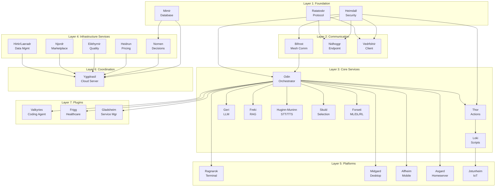

# Edda Master Implementation Plan

## Executive Summary

Edda comprises 30+ microservices/platforms organized into Core Services, Infrastructure, Platforms, and Supporting Services. This master plan tracks implementation status, dependencies, and defines the critical path for development.

**Current System Status:** ~45% complete

- 8 projects complete (Odin, Ratatoskr, Nornen, Skuld, **Bifrost, Heimdall, Nidhoggr, Vedrfolnir** ✅)
- 3 projects mostly complete (**Geri ~86%**, **Mimir ~95%**, **Freki ~75%** ✅)
- 3 projects in progress (Thor ~72%, Huginn-Muninn ~78%, Loki ~78%)
- 2 projects mostly complete (Ragnarok ~70%, Gladsheim ~78%)
- 19+ projects not started

## Architecture Overview

## Implementation Layers

### Layer 1: Foundation (No Dependencies)

Critical foundation services that others depend on. Must be implemented first.

**Projects:** Heimdall (Security), Ratatoskr (Protocol), Mimir (Database)

**Rationale:** These services have minimal dependencies and are required by multiple other services. Heimdall provides authentication/authorization, Ratatoskr defines the business protocol, and Mimir provides privacy-focused data storage.

### Layer 2: Communication (Depends on Layer 1)

Communication infrastructure enabling device-to-device and device-to-cloud connections.

**Projects:** Bifrost (Device Mesh), Nidhoggr (Cloud Endpoint), Vedrfolnir (Connection Client)

**Rationale:** Bifrost depends on Heimdall for security. Nidhoggr and Vedrfolnir depend on both Ratatoskr (protocol) and Heimdall (authentication).

### Layer 3: Core Services (Depends on Layers 1-2)

Main AI services providing orchestration, actions, LLM, RAG, STT/TTS, and ML capabilities.

**Projects:** Odin (Orchestrator), Thor (Actions), Geri (LLM), Freki (RAG), Huginn-Muninn (STT/TTS), Skuld (LLM Selection), Loki (Scripts), Forseti (ML/DL/RL)

**Rationale:** Odin is already complete. Thor, Geri, Freki, and others provide core AI functionality. Loki enables script execution for IoT devices.

### Layer 4: Infrastructure Services (Depends on Layers 1-3)

Cloud-based infrastructure services for decision routing, pricing, quality assessment, and marketplace.

**Projects:** Nornen (Decision Routing), Heidrun (Token/Pricing), Eikthyrnir (Quality Assessment), Njordr (Marketplace), Hirtir/Laeradr (Consolidated Data Management)

**Rationale:** These services coordinate cloud operations and depend on Mimir for storage, Nornen for routing, and other microservices.

### Layer 5: Platforms (Depends on Layers 1-4)

User-facing platforms that integrate core services for different device types.

**Projects:** Ragnarok (Terminal), Midgard (Desktop), Alfheim (Mobile), Asgard (Homeserver), Jotunheim (IoT)

**Rationale:** Platforms are thin integration layers that call core services via gRPC. Jede Platform-Installation (Midgard, Alfheim, Asgard, Ragnarok; Jotunheim ausgenommen) MUSS eine lokale Gladsheim-Instanz enthalten, die Odin, Thor, Loki und weitere Services (je nach Konfiguration) verwaltet und ausführt. Platforms implementieren kein eigenes Service-Lifecycle-/Process-Management, sondern delegieren dieses vollständig an Gladsheim.

### Layer 6: Cloud Coordination (Depends on All Layers)

Central cloud server coordinating all microservices and providing user management.

**Projects:** Yggdrasil (Cloud Server)

**Rationale:** Yggdrasil coordinates all infrastructure microservices (Nornen, Heidrun, Eikthyrnir, Njordr, Nidhoggr, Hirtir/Laeradr) and requires them to be implemented first.

### Layer 7: Plugins & Extensions (Depends on Core)

Specialized plugins providing domain-specific functionality.

**Projects:** Valkyries (Coding Agent), Frigg (Healthcare), Gladsheim (Service Manager)

**Rationale:** Plugins depend on Odin for orchestration and Thor for action execution. Can be implemented after core services are stable. **Hinweis:** Gladsheim ist verpflichtende Infrastruktur für alle Platforms (außer Jotunheim) und stellt das lokale Runtime-/Service-Management (u. a. Odin, Thor, Loki) bereit. Valkyries und Frigg bleiben optionale Plugins, die zusätzlich auf einer Platform installiert werden können.

## Critical Path Analysis

**Foundation (Layer 1–2):** Heimdall, Ratatoskr, Mimir, Bifrost, Nidhoggr, Vedrfolnir are complete or mostly complete. No longer blocking.

**Current Blockers / High-Priority Completions:**

1. **Thor** (in progress ~72%) – blocks Loki and all platforms; Kernfunktionalität steht. Phase 12.2 (Windows UI-Automation) ✅, 13.2 (Windows Task Scheduler) ✅; Stub-/OS-Dispatch-Tests in CI ✅. Remaining: Phase 12.3/12.4 (echte macOS/Linux UI), 13.3 (echte launchd auf macOS), optional Phase 15 Performance-Tests. Kalender: nicht in Thor (evtl. Odin, Konzept offen).
2. **Geri** (mostly complete ~86%) – blocks Forseti; remaining: Phase 4 (llama.cpp/BitNet), Phase 6/9/12–13/17, Tests ausführen.
3. **Skuld** (complete) – optional Phase 4 factors. No blocker.
4. **Loki** (~78%) – depends on Thor; remaining optional. Jotunheim unblocked.
5. **Gladsheim** (~78%) – Container-Setup ✅, Test-Framework ✅, CI/CD ✅; Phase 2.1 (Proto) im Plan abgehakt. Offen: 3 technische Fragen; weitere Phasen je nach Bedarf.

## Project Status Matrix

| Project        | Status          | Progress | Dependencies                  | Blocks                              | Layer |
| -------------- | --------------- | -------- | ----------------------------- | ----------------------------------- | ----- |
| Heimdall       | Mostly Complete | 90%      | -                             | Bifrost, Thor, Nidhoggr, Vedrfolnir | 1     |
| Ratatoskr      | Complete        | 100%     | -                             | Nidhoggr, Vedrfolnir                | 1     |
| Mimir          | Mostly Complete | 95%      | -                             | Nornen, Yggdrasil                   | 1     |
| Bifrost        | Mostly Complete | 85%      | Heimdall                      | Odin, Platforms                     | 2     |
| Nidhoggr       | Mostly Complete | 85%      | Ratatoskr, Heimdall           | Yggdrasil                           | 2     |
| Vedrfolnir     | Mostly Complete | 85%      | Ratatoskr, Heimdall           | Platforms                           | 2     |
| Odin           | Complete        | 100%     | Bifrost, Heimdall             | All Platforms, Plugins              | 3     |
| Thor           | In Progress     | 72%      | Odin, Heimdall                | Loki, Platforms, Forseti            | 3     |
| Geri           | Mostly Complete | 86%      | Odin                          | Forseti, Platforms                  | 3     |
| Freki          | Mostly Complete | 75%      | Odin                          | Platforms, Forseti                  | 3     |
| Huginn-Muninn  | In Progress     | 78%      | Odin                          | Platforms                           | 3     |
| Skuld          | Complete        | 100%     | Odin                          | Platforms                           | 3     |
| Loki           | In Progress     | 78%      | Thor                          | Jotunheim                           | 3     |
| Forseti        | Not Started     | 5%       | Odin, Geri, Thor, Freki       | Plugins                             | 3     |
| Nornen         | Complete        | 100%     | Mimir                         | Yggdrasil, Infrastructure           | 4     |
| Heidrun        | Not Started     | 0%       | Yggdrasil                     | Njordr, Eikthyrnir                  | 4     |
| Eikthyrnir     | Not Started     | 0%       | Yggdrasil                     | Njordr                              | 4     |
| Njordr         | Not Started     | 0%       | Heidrun, Eikthyrnir, Nornen   | Yggdrasil                           | 4     |
| Hirtir/Laeradr | Not Started     | 0%       | Mimir, Nornen                 | Yggdrasil                           | 4     |
| Ragnarok       | Mostly Complete | 70%      | Gladsheim (lokal, required), Odin, Thor, Core Services | -                         | 5     |
| Midgard        | Not Started     | 5%       | Gladsheim (lokal, required), Odin, Thor, Core Services | -                         | 5     |
| Alfheim        | Not Started     | 5%       | Gladsheim (lokal, required), Odin, Thor, Core Services | -                         | 5     |
| Asgard         | Not Started     | 5%       | Gladsheim (lokal, required), Odin, Heimdall, Core Services | -                      | 5     |
| Jotunheim      | In Progress     | 75%      | Loki                          | -                                   | 5     |
| Yggdrasil      | Not Started     | 0%       | All Infrastructure            | -                                   | 6     |
| Valkyries      | Not Started     | 0%       | Odin, Thor, Geri              | -                                   | 7     |
| Frigg          | Not Started     | 0%       | Odin, Thor, Yggdrasil         | -                                   | 7     |
| Gladsheim      | Mostly Complete | 78%      | Odin, Heimdall                | -                                   | 7     |

## Key Technical Decisions Required

### Immediate Decisions

1. **Hirtir/Laeradr Consolidation:** DECISION MADE - Consolidate into single project
2. **Gladsheim Technical Choices:** Mark as "to be decided" - gRPC framework, health check strategy, process management

### Open Questions in Projects

- **Bifrost:** WebSocket library, TLS library, mDNS library, NAT traversal libraries (6 questions)
- **Heimdall:** Protobuf tool, Database, Crypto library, Token expiration, OAuth providers (5 questions)
- **Skuld:** Protobuf tool, Database (2 questions)
- **Loki:** Protobuf tool, Script engine, Config format, Script storage (4 questions)
- **Asgard:** Database choice, Web dashboard, API framework, NAT-Traversal libraries (4 questions)

## Implementation Todos by Layer

Detailed project-specific todos are maintained in each project's `IMPLEMENTATION_PLAN.md`. The master plan tracks layer-level completion and cross-project dependencies.

### Layer 1: Foundation

- [x] **Heimdall** - ✅ Phase 14 (Encryption & TLS), Phase 15 (Performance), Phase 17 (Security-Dokumentation) complete. CI: Test, Lint, Coverage (tarpaulin) ✅. Remaining: Optional phases (Email/Code-Verification, OAuth Integration). Currently ~90% complete.
- [x] **Ratatoskr** - ✅ COMPLETE - WebSocket protocol fully implemented (all 8 phases, 73 steps). Ready for Nidhoggr and Vedrfolnir integration.
- [x] **Mimir** - ✅ Phase 1-12 complete (**PRODUKTIONSBEREIT**). Remaining: Phase 12 optional (Load/Stress, Data-Leak, Key-Management). Currently ~95% complete. CRITICAL BLOCKER for Nornen and Yggdrasil.

### Layer 2: Communication

- [x] **Bifrost** - ✅ Phase 1-20 complete (**PRODUKTIONSBEREIT**). NAT Traversal (STUN, TURN Client, ICE Manager, Port-Forwarding), mDNS/Bonjour, alle Test-Suites. Currently ~95% complete.
- [x] **Nidhoggr** - ✅ Phase 1-7, 9 complete (85%). Remaining: Performance benchmarks, Performance tests. Depends on Ratatoskr ✅ and Heimdall ✅.
- [x] **Vedrfolnir** - ✅ Phase 1-8 complete (**PRODUKTIONSBEREIT**). Currently ~95% complete. Depends on Ratatoskr ✅ and Heimdall ✅.

### Layer 3: Core Services

**Concurrency & Parallelism**: All LLM-related services (Geri, Odin, Skuld, Freki, Valkyries, Frigg) MUST implement concurrency/parallelism as per root AGENTS.md principle 4. Key aspects: concurrent request handling, explicit limits (`max_concurrent_requests`, `parallel_agents`), parallel sub-tasks where possible, load tests with ≥10 concurrent requests.

- [ ] **Thor** - Phase 1–11 ✅, Phase 12.1+12.2 (UI-Automation: Windows ✅, Stub-Tests CI ✅), Phase 13.1+13.2+13.5 (Cron ✅, Windows Task Scheduler ✅, OS-Dispatch-Test ✅), Phase 14 (Jotunheim) ✅, Phase 15 (Docs/E2E/Security) ✅. Remaining: Phase 12.3/12.4 (echte macOS/Linux UI), 13.3 (echte launchd auf macOS), Phase 15 Performance-Tests (optional). Kalender nicht in Thor (evtl. Odin). Currently ~72% complete. **Kernfunktionalität steht**.
- [ ] **Geri** - Phase 1.1.2 (Struktur) ✅, Phase 1.2.3 (CI/CD) ✅, Phase 1.3 (Settings-Schema, Validierung, Loader, Hot-Reload) ✅, Phase 2.1 (Protobuf Wolf/Vision Protocol) ✅, **Phase 5 (Cloud LLM Providers) ✅**, Phase 6.1.1+6.1.2 (ModelInfo, ModelRegistry) ✅, Phase 6.2.1 (ModelHealthChecker) ✅, Phase 7 (Efficiency-Score, ModelSelector, LoadBalancer) ✅, Phase 8 (Prompt/Context/Token/Context-Window) ✅, Phase 9 (Cost) ✅, Phase 10.x (Fallback, Notification, BudgetReset) ✅, Phase 11.x (Cache) ✅, Phase 12.1.1 (StreamingManager) ✅, Phase 12.2.1 (VideoStreamProcessor, FrameAnalyzer) ✅, Phase 13.1.1 (RequestQueueManager) ✅, Phase 13.2.1 (PriorityQueueManager) ✅, Phase 14.1.1 (SecureKeyStorage, SecureKeyBackend) ✅, Phase 14.2.1 (KeyRotationManager) ✅, Phase 15.1.1 (MetricsCollector) ✅, Phase 15.2.1 (ModelPerformanceTracker) ✅, Phase 16.1.1 (ProviderErrorHandler, GrpcStatusCode) ✅, Phase 16.2.1 (RetryManager) ✅, Phase 18.1.1 (Logging-Setup) ✅, Phase 18.2.1 (ContextLogger) ✅, Phase 19.1.1 (gRPC-Service-Dokumentation) ✅, Phase 19.2.1 (Provider-Integration-Guide) ✅, Phase 20.1.1 (E2E-Tests) ✅, Phase 20.2.1 (Performance Test Suite) ✅, Phase 20.3.1 (Load Test Suite) ✅, Phase 1.1.3 (Cargo-Features) ✅, Phase 3.1.2 (VisionProvider-Trait) ✅. Remaining: Phase 1.2.1–1.2.2, Phase 4 (llama.cpp/BitNet.cpp), Phase 6 (ohne 6.1–6.2.1), Phase 9.1, Phase 12.2–13, Phase 17. **Container-Build + 200 Tests grün** (inkl. Phase 20.2/20.3 Performance/Load) ✅. Currently ~86% complete. **Concurrency**: `max_concurrent_requests`, `LoadBalancer`, load tests ✅.
- [ ] **Freki** - Phase 1.1–1.2.1, 2–9, 13–17, 18.1.1 (gRPC-API-Dokumentation), 18.2.1 (Rustdoc), 18.2.2 (Architecture-Diagramme), 18.3.1, 19.1–19.3 ✅; Phase 7 (Change-Detection, Incremental-, Full-Re-Indexing) ✅; Phase 8.1 (Watch-Folder-Manager, Auto-Indexing-Manager) ✅. Remaining: Phase 4.2 (Sentence-Transformers FFI - komplex), Phase 10–12 (Caching, Hybrid-Search, Re-Ranking - optional), 16.2–16.3 (Document-Encryption, Access-Control - optional). Currently ~75% complete. **Concurrency**: Parallel indexing, concurrent queries, load tests ✅. **PRODUKTIONSBEREIT mit Embedding-Stubs**.
- [ ] **Huginn-Muninn** - Phase 1 (inkl. 1.1.4 Build-System, 1.2 Test-Infra/CI, 1.3 Settings) ✅, Phase 2 (Protobuf & gRPC) ✅, Phase 3 (Audio-Processing) ✅, Phasen 6–10, 8, 9, 12, 13, 14.1 (Text/Image/Video-Input, Caching, Error/Retry, Language, Logging, Metrics, E2E-Tests) ✅. Remaining: Phase 4.2+ (Whisper/Vosk FFI), 5.2+/7.2+ (Coqui/Piper FFI), 9.1 (Service-Fallback), 11 (Streaming/Performance), Cloud-Integration. Currently ~78% complete. Depends on Odin ✅.
- [x] **Skuld** - Phase 1–9 ✅ (inkl. Phase 2 Geri gRPC-Client, Eikthyrnir-Client, Cache, Query-Optimization, E2E-, Performance-Tests). Remaining: Phase 4 optionale Faktoren (Size, Hardware, Latency, etc.). Currently ~100% complete (optional Phase 4). **Concurrency**: Parallel model evaluation ✅.
- [ ] **Loki** - Phase 1–14 ✅ (inkl. Fenrir, Jörmungandr, Hel, Coordination, Error/Resilience, Cache, Performance-Monitor, Docs, E2E, Performance-, Security-Tests). Code-Coverage (tarpaulin) ✅. Remaining: optional (Phase 14 Performance-Benchmarks, weitere Docs). Currently ~78% complete. Depends on Thor (70% - Kernfunktionalität ✅).
- [ ] **Forseti** - Implement ML/DL/RL service (PyTorch/TensorFlow, Rust-native ML, RL Engine, Model Management). Depends on Odin, Geri, Thor, Freki.

### Layer 4: Infrastructure Services

- [x] **Nornen** - ✅ COMPLETE - All 8 phases implemented (Provider Registry, Request Routing, Coordination, Performance Optimization, Security & Monitoring, Documentation & Testing). Ready for Yggdrasil integration.
- [ ] **Heidrun** - Implement token/pricing service (Token Counting, Pricing, Settlement, Pre-Authorization). Depends on Yggdrasil.
- [ ] **Eikthyrnir** - Implement quality assessment service (Quality Metrics, Aggregation, Periodic Tests). Depends on Yggdrasil.
- [ ] **Njordr** - Implement marketplace service (Provider Management, Fair Distribution, Transaction Management). Depends on Heidrun, Eikthyrnir, Nornen.
- [ ] **Hirtir/Laeradr** - Consolidate into single Data Management Service. Implement Dáinn (Indexing), Dvalinn (Validation), Duneyrr (Aggregation), Duraþrór (Retention). Depends on Mimir, Nornen.

### Layer 5: Platforms

- [x] **Ragnarok** - Phase 1–8 ✅ (inkl. Container-Tests, Code-Coverage tarpaulin). E2E: Mock-Odin gRPC + e2e_chat_via_odin_returns_response. Phase 2/4: Thor ✅, Geri ✅, Freki ✅, Huginn ✅, Muninn ✅ gRPC-Clients (transcribe, speak). Currently ~70% complete. **Architektur:** Wird mit lokaler Gladsheim-Instanz ausgeliefert (Odin, Thor, Loki, weitere Services via Gladsheim gemanagt).
- [ ] **Midgard** - Implement desktop platform (200+ steps across 16 phases). Depends on Gladsheim (lokal, required), Odin, Thor, Geri, Freki, Huginn-Muninn, Bifrost. Service-Lifecycle-Management erfolgt über Gladsheim.
- [ ] **Alfheim** - Implement mobile platform (200+ steps across 18 phases). Depends on Gladsheim (lokal, required), Odin, Thor, Geri, Freki, Huginn-Muninn, Bifrost. Service-Lifecycle-Management erfolgt über Gladsheim (battery-aware Config).
- [ ] **Asgard** - Implement homeserver platform (400+ steps across 22 phases). Resolve database and API framework decisions. Depends on Gladsheim (lokal, required), Odin, Heimdall, Bifrost. Gladsheim verwaltet Odin, Thor, Loki und weitere Services auf dem Homeserver.
- [ ] **Jotunheim** - Phase 1–13 ✅ (Build, Proto/gRPC, Network, Capability, Remote, Resources, OTA, Resilience, Streaming, Monitoring/Logging, Docs, E2E/Performance/Resource-Tests). Test-Data-Generators ✅, Code-Coverage (tarpaulin) ✅. Remaining: Phase 10 (optional: Memory/Code-Size auf ESP32-Hardware). Depends on Loki. Currently ~75% complete.

### Layer 6: Cloud Coordination

- [ ] **Yggdrasil** - Implement cloud server coordinator (135 steps across 12 phases). Depends on Nornen, Heidrun, Eikthyrnir, Njordr, Nidhoggr, Hirtir/Laeradr, Mimir.

### Layer 7: Plugins & Extensions

- [ ] **Valkyries** - Implement coding agent plugin (81 steps across 9 phases). Depends on Odin, Thor, Geri.
- [ ] **Frigg** - Implement healthcare plugin (250+ steps across 18 phases). Depends on Odin, Thor, Yggdrasil. Requires isolated PostgreSQL database.
- [ ] **Gladsheim** - Implement service manager (Thjalfi, Byggvir, Roskva, Skirnir). Resolve 3 open technical questions. **Verpflichtende Infrastruktur:** Jede Platform-Installation (Midgard, Alfheim, Asgard, Ragnarok) MUSS eine lokale Gladsheim-Instanz enthalten, die Odin, Thor, Loki und weitere Services verwaltet. Depends on Odin, Heimdall.

### Cross-Project Tasks

- [x] Ensure all project `IMPLEMENTATION_PLAN.md` files have todos for remaining tasks: Ragnarok, Thor, Loki, Jotunheim, Huginn-Muninn, Freki, Geri, Nidhoggr, Skuld have a "Verbleibende [optionale] Punkte (Übersicht)" section; other projects track remaining work in-phase.
- [ ] Resolve open technical questions across projects: Bifrost (6 questions), Heimdall (5 questions), Skuld (2 questions), Loki (4 questions), Asgard (4 questions), Gladsheim (3 questions).

## Recommended Implementation Order

Based on the dependency analysis, here is the recommended implementation sequence:

**Phase 1: Complete Foundation (Months 1-2)**
1. Complete Heimdall (finish remaining 15%)
2. Implement Ratatoskr (protocol definition)
3. Implement Mimir (database service)

**Phase 2: Complete Communication (Months 2-3)**
4. Complete Bifrost (finish remaining 20%)
5. Implement Nidhoggr (cloud endpoint)
6. Implement Vedrfolnir (connection client)

**Phase 3: Complete Core Services (Months 3-6)**
7. Complete Thor (finish remaining 80%)
8. Complete Geri (finish remaining 85%)
9. Complete Skuld (finish remaining 85%)
10. Implement Freki (RAG service)
11. Implement Huginn-Muninn (STT/TTS)
12. Implement Loki (script execution)
13. Implement Forseti (ML/DL/RL)

**Phase 4: Infrastructure Services (Months 6-8)**
14. ✅ Nornen - COMPLETE
15. Implement Hirtir/Laeradr (consolidated data management)
16. Implement Heidrun (pricing service)
17. Implement Eikthyrnir (quality assessment)
18. Implement Njordr (marketplace)

**Phase 5: Platforms (Months 8-11)**
19. Complete Ragnarok (finish remaining 85%)
20. Implement Midgard (desktop)
21. Implement Alfheim (mobile)
22. Implement Asgard (homeserver)
23. Implement Jotunheim (IoT)

**Phase 6: Cloud Coordination (Months 11-12)**
24. Implement Yggdrasil (cloud server)

**Phase 7: Plugins & Extensions (Months 12+)**
25. Implement Valkyries (coding agent)
26. Implement Frigg (healthcare)
27. Implement Gladsheim (service manager)

## Nächste Schritte (Current Focus)

Priorisierte nächste Aufgaben – jeweils im Projekt-`IMPLEMENTATION_PLAN.md` detailliert:

1. **Thor** – Phase 12.2 ✅ (Windows UI-Automation), 13.2 ✅ (Windows Task Scheduler), 13.3 Dispatch ✅. Stub-/OS-Dispatch-Tests in CI ✅. Remaining: 12.3/12.4 (echte macOS/Linux UI), 13.3 (echte launchd-Implementierung auf macOS). Optional: Phase 8 Sandboxing, Phase 10 Async-Processing. **Kalender:** Thor benötigt keinen Kalender; falls gewünscht, wäre das bei Odin (Konzept noch in Überlegung).
2. **Geri** – Phase 1.2.3 (CI Code-Coverage tarpaulin) ✅; Dockerfile.test angepasst ✅. **Lib-Compile behoben** ✅. **Container-Build + 200 Tests grün** (inkl. Performance- und Load-Tests) ✅. Phase 20 (E2E/Performance/Load ausführen) ✅. Verbleibend: Phasen 4, 6, 9.1, 12.2–13, 17.
3. **Gladsheim** – Phase 1.2.1 (Container-Setup) ✅, 1.2.2 (Test-Framework) ✅, 1.2.3 (CI/CD) ✅; Phase 2.1 (Proto) ✅; Byggvir Enforcer-Fix ✅; Phase 5.2.2 (Monitoring-Loop) ✅; Phase 5.3.1 (Restart-Policy) ✅; Phase 5.3.2 (Attempt-Tracking, evaluate_restart, Reset-on-healthy) ✅; alle 43 Tests grün ✅. Offen: 3 technische Fragen; Thjalfi.restart_service()-Aufruf an Integration.
4. **Cross-Project** – Offene technische Fragen in Bifrost (6), Heimdall (5), Skuld (2), Loki (4), Asgard (4), Gladsheim (3) resolven.
5. **Ragnarok** – Thor-Client + Action-Integration ✅; Geri/Freki-Clients in CLI integriert ✅ (Config `geri`/`freki`, Commands `prompt`, `models`, `retrieve`). Huginn-Muninn gRPC-Client ✅ (Config `huginn`/`muninn`, Commands `transcribe`, `speak`). Test-Infrastruktur: Dockerfile.test mit protoc, build.rs mit expliziten Proto-Dateien. Lifecycle-Tests angepasst; alle Tests grün.

Nach Abschluss eines Todos: Eintrag im jeweiligen Projekt-`IMPLEMENTATION_PLAN.md` abhaken und ggf. diesen Master-Plan aktualisieren.

## Notes

- This is a living document that should be updated as projects progress
- Each project maintains its own detailed `IMPLEMENTATION_PLAN.md` with specific todos
- Progress percentages are estimates based on completed phases/tasks
- Dependencies may be relaxed for optional features (e.g., platforms can start basic implementation before all core services are complete)
- The recommended order prioritizes critical path items but allows for parallel development where dependencies permit
