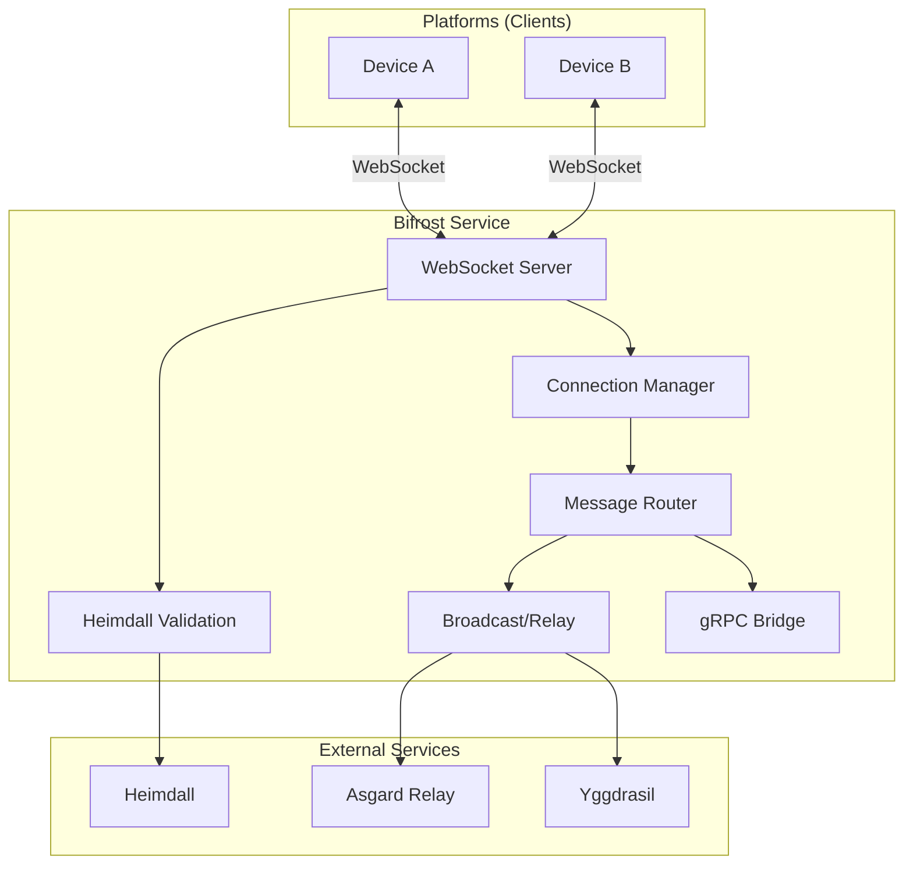
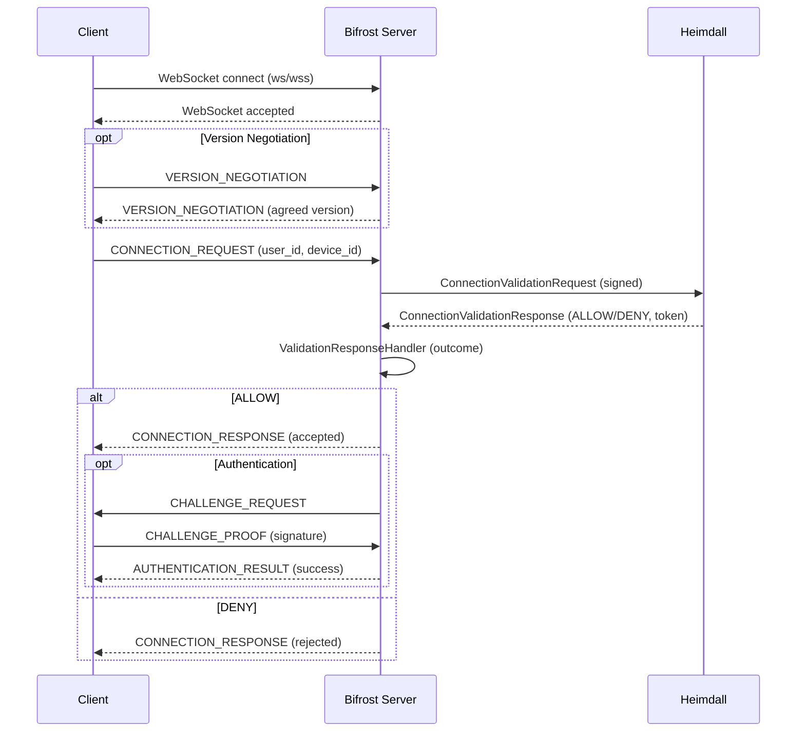
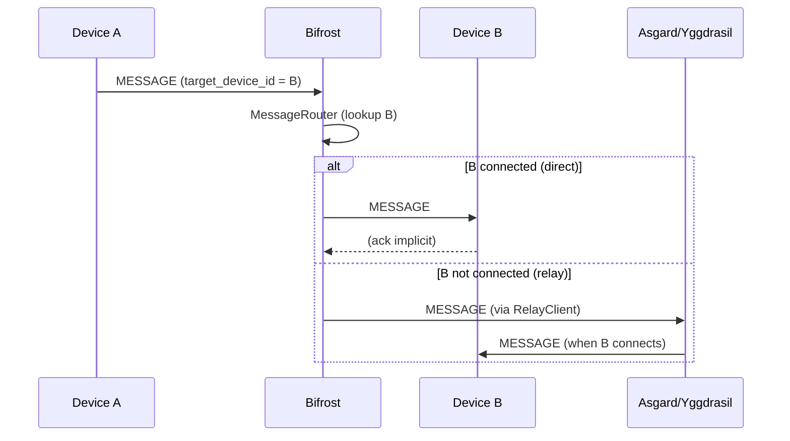

# Bifrost Architecture (Phase 19.2.2)

Architektur-Überblick und Ablaufdiagramme für Connection-Establishment und Message-Routing. Referenz: [BIFROST_PROTOCOL_SPECIFICATION](BIFROST_PROTOCOL_SPECIFICATION.md), [SERVICE_INTEGRATION_PROTOCOLS](SERVICE_INTEGRATION_PROTOCOLS.md).

---

## 1. Architecture-Diagramm (Komponenten)

**Komponenten (vereinfacht):**

- **WebSocket Server**: Annahme von Verbindungen, Upgrade, Message-Empfang/-Versand.
- **Connection Manager**: Verwaltung aktiver Connections (Register/Get/ListByDevice/Remove).
- **Message Router**: Routing von BifrostMessages an Ziel-Device(s) (direkt oder über Relay).
- **Heimdall Validation**: Connection-Validation-Request/Response, User-Identity, Cross-User-Blocking.
- **Broadcast/Relay**: Broadcast an alle Devices, Relay über Asgard/Yggdrasil bei nicht erreichbarem Ziel.
- **gRPC Bridge**: Tunneln von gRPC-Requests/Responses (z. B. ThorAction) über Bifrost.

---

## 2. Sequence-Diagramm: Connection-Establishment

**Schritte:**

1. Client öffnet WebSocket zu Bifrost.
2. Optional: Version-Negotiation.
3. Client sendet CONNECTION_REQUEST (user_id, device_id).
4. Bifrost fragt Heimdall (ConnectionValidationRequest/Response).
5. Bifrost sendet CONNECTION_RESPONSE (angenommen/abgelehnt).
6. Optional: Challenge/Proof → AUTHENTICATION_RESULT.

---

## 3. Sequence-Diagramm: Message-Routing

**Varianten:**

- **Direct Routing**: Ziel-Device ist am gleichen Bifrost verbunden → Message wird direkt an die Connection von B gesendet.
- **Relay Routing**: Ziel nicht lokal erreichbar → Message wird über Asgard- oder Yggdrasil-Relay gesendet; Relay leitet an B weiter, sobald B verbunden ist.
- **Broadcast**: Message wird an alle verbundenen Devices (außer Sender) gesendet.
- **gRPC-Tunnel**: GRPC_REQUEST wird wie MESSAGE geroutet; Antwort als GRPC_RESPONSE korreliert über request_id.

---

## 4. Testing

Die Architektur wird durch die Phase-20-Test-Suites abgedeckt: E2E Communication Workflows (`e2e_communication_workflow_test.rs`), Error Recovery (`error_recovery_test.rs`), Performance Benchmarks (`performance_benchmark_test.rs`), Security Test Suite (`security_test_suite.rs`), GDPR Compliance (`gdpr_compliance_test.rs`). Ausführung: `docker compose -f docker-compose.test.yml run --rm bifrost-test`. CI: [.github/workflows/bifrost.yml](../../.github/workflows/bifrost.yml). Siehe [README Phase 20 Test Suites](../README.md#phase-20-test-suites-implementation_plan).

---

## 5. Referenzen

- [BIFROST_PROTOCOL_SPECIFICATION](BIFROST_PROTOCOL_SPECIFICATION.md) – Message-Types, Connection- und Auth-Workflow.
- [SERVICE_INTEGRATION_PROTOCOLS](SERVICE_INTEGRATION_PROTOCOLS.md) – Heimdall, Asgard, Yggdrasil.
- [MESH_LAYER_DESIGN](MESH_LAYER_DESIGN.md) – Mesh-Paketformat und -Routing.
- IMPLEMENTATION_PLAN Phase 6 (WebSocket Server), Phase 9 (Message Routing), Phase 5 (Connection Validation), Phase 20 (Testing & QA).
