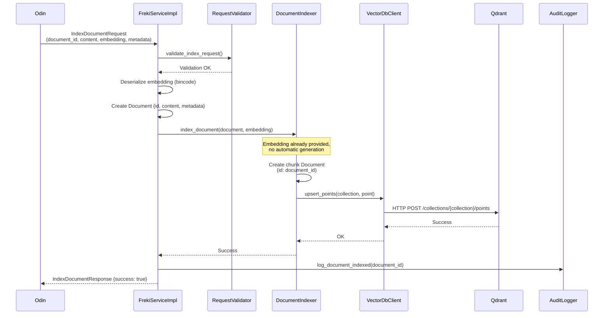
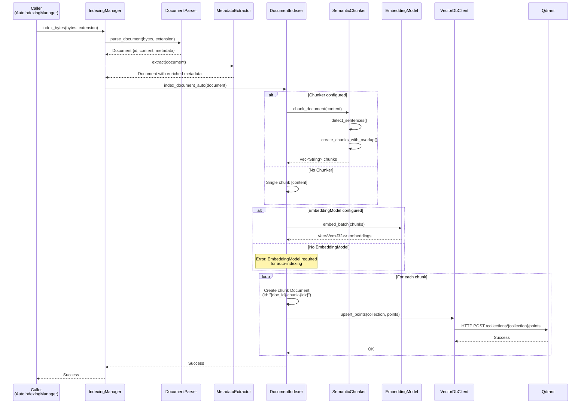
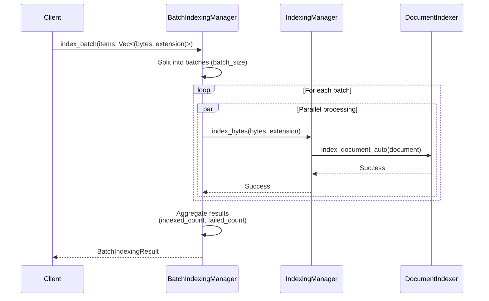
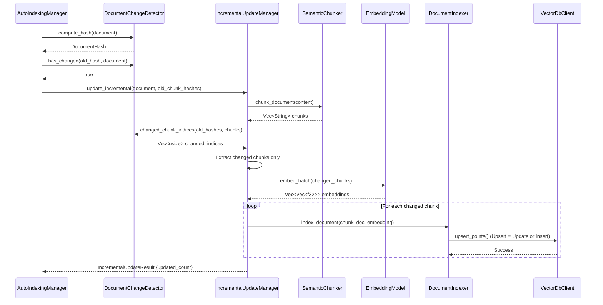
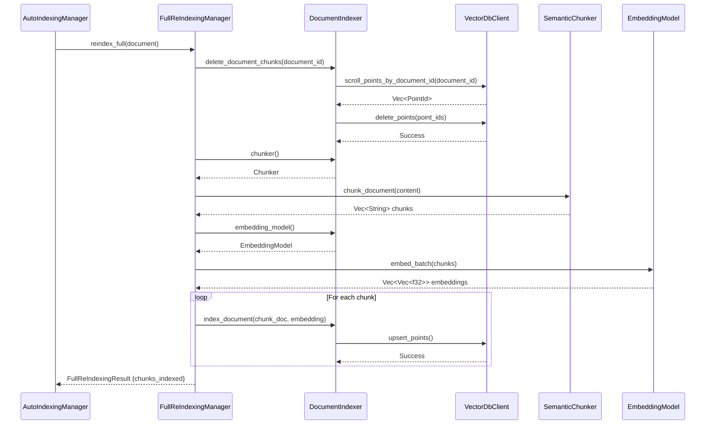
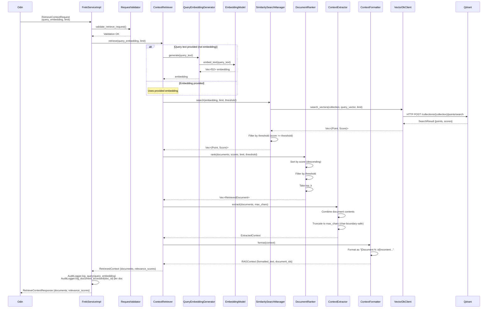
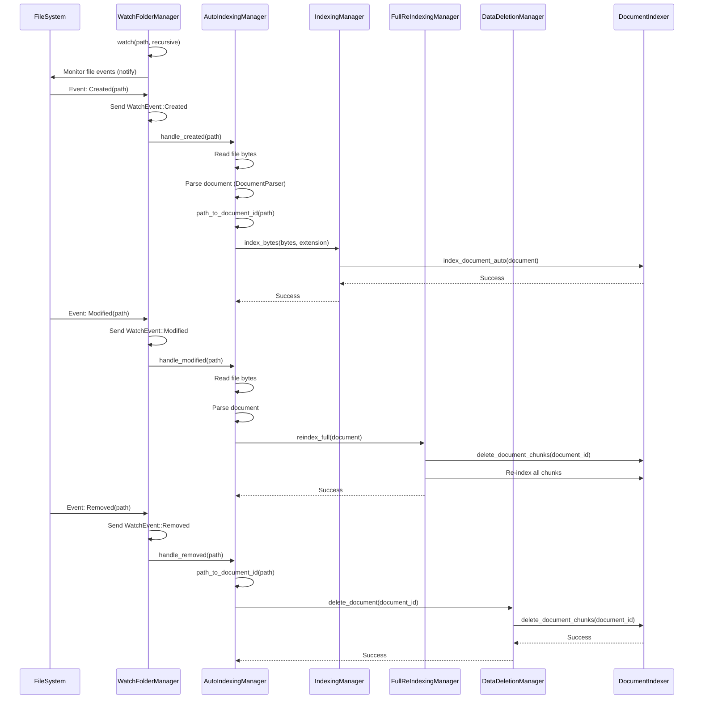

# Freki Architecture Documentation

## Übersicht

Dieses Dokument beschreibt die Architektur von Freki, dem RAG (Retrieval Augmented Generation) Service. Freki verwaltet Vector-Database-Operationen, Document-Indexing, Context-Retrieval und Prompt-Enrichment.

## Gesamtarchitektur

```mermaid
graph TB
    subgraph External["External Services"]
        Odin[Odin<br/>Orchestrator]
        Qdrant[Qdrant<br/>Vector Database]
    end
    
    subgraph FrekiService["Freki Service"]
        subgraph GRPC["gRPC Layer"]
            Server[FrekiServiceImpl<br/>gRPC Server]
            Validator[RequestValidator]
        end
        
        subgraph Indexing["Indexing Pipeline"]
            Parser[DocumentParser<br/>TextParser]
            Metadata[MetadataExtractor]
            Manager[IndexingManager]
            Indexer[DocumentIndexer]
            Batch[BatchIndexingManager]
            ChangeDet[DocumentChangeDetector]
            IncUpdate[IncrementalUpdateManager]
            FullReindex[FullReIndexingManager]
        end
        
        subgraph Retrieval["Retrieval Pipeline"]
            QueryEmb[QueryEmbeddingGenerator]
            SimSearch[SimilaritySearchManager]
            Ranker[DocumentRanker]
            Extractor[ContextExtractor]
            Formatter[ContextFormatter]
            Retriever[ContextRetriever]
        end
        
        subgraph Chunking["Chunking"]
            Chunker[SemanticChunker]
            SentenceDet[SentenceBoundaryDetector]
        end
        
        subgraph Embedding["Embedding"]
            EmbedModel[EmbeddingModel<br/>SentenceTransformers]
            Registry[ModelRegistry]
        end
        
        subgraph Watch["Watch & Auto-Indexing"]
            WatchMgr[WatchFolderManager]
            AutoIndex[AutoIndexingManager]
        end
        
        subgraph Utils["Utilities"]
            ErrorHandler[IndexingErrorHandler<br/>RetrievalErrorHandler]
            Audit[AuditLogger]
            Metrics[MetricsCollector]
            PerfAlert[PerformanceAlertManager]
            DataDel[DataDeletionManager]
            DataExp[DataExportManager]
        end
        
        subgraph VectorDB["Vector DB Client"]
            Client[VectorDbClient<br/>Qdrant Client]
            Collection[CollectionManager]
            Retry[ConnectionRetryManager]
        end
    end
    
    Odin -->|gRPC Requests| Server
    Server -->|Validates| Validator
    Validator -->|IndexDocument| Manager
    Validator -->|RetrieveContext| Retriever
    
    Manager -->|Parses| Parser
    Manager -->|Extracts Metadata| Metadata
    Manager -->|Indexes| Indexer
    
    Indexer -->|Chunks| Chunker
    Chunker -->|Detects Sentences| SentenceDet
    Indexer -->|Generates Embeddings| EmbedModel
    EmbedModel -->|Registered in| Registry
    
    Indexer -->|Stores| Client
    Client -->|Manages Collections| Collection
    Client -->|Retries on Error| Retry
    Client -->|Connects to| Qdrant
    
    Batch -->|Manages| Manager
    
    ChangeDet -->|Detects Changes| Indexer
    IncUpdate -->|Updates Changed Chunks| Indexer
    FullReindex -->|Re-indexes| Indexer
    
    WatchMgr -->|File Events| AutoIndex
    AutoIndex -->|Indexes/Re-indexes| Manager
    AutoIndex -->|Deletes| DataDel
    
    Retriever -->|Generates Query Embedding| QueryEmb
    QueryEmb -->|Uses| EmbedModel
    Retriever -->|Searches| SimSearch
    SimSearch -->|Queries| Client
    Retriever -->|Ranks| Ranker
    Retriever -->|Extracts| Extractor
    Retriever -->|Formats| Formatter
    
    Server -->|Logs| Audit
    Server -->|Collects| Metrics
    Metrics -->|Alerts| PerfAlert
    
    Manager -->|Handles Errors| ErrorHandler
    Retriever -->|Handles Errors| ErrorHandler
    
    Server -->|Returns Response| Odin
```



## Indexing-Flows

Es gibt zwei verschiedene Indexing-Flows in Freki:

1. **gRPC IndexDocument Flow**: Extern über gRPC API (Odin → Freki), Embedding bereits vorhanden
2. **Internal Auto-Indexing Flow**: Intern über Watch-Folder-Manager, automatische Embedding-Generierung

**Warum zwei verschiedene Flows?**

- **gRPC Flow**: Odin hat bereits das Embedding (z. B. von einem externen Embedding-Service) und möchte das Dokument direkt indizieren. Kein Chunking oder automatische Embedding-Generierung erforderlich.
- **Interner Flow**: Für lokale Dateien (z. B. über Watch-Folder) muss Freki das Dokument parsen, chunken und Embeddings generieren, bevor es indiziert werden kann.

**Verwendung**:
- **`DocumentIndexer.index_document(doc, embedding)`**: Für gRPC API (externes Embedding vorhanden)
- **`DocumentIndexer.index_document_auto(doc)`**: Für internes System (automatisches Chunking + Embedding)

### gRPC IndexDocument Flow (External API)

Dieser Flow wird von Odin über die gRPC API aufgerufen. Das Embedding ist bereits vorhanden und wird im Request mitgeliefert.



### Internal Auto-Indexing Flow

Dieser Flow wird intern vom `IndexingManager` verwendet (z. B. über `WatchFolderManager`). Embedding und Chunking werden automatisch durchgeführt.



### Batch-Indexing-Flow



### Incremental-Update-Flow



### Full-Re-Indexing-Flow



## Retrieval-Flow

Der Retrieval-Flow beschreibt, wie relevanter Context basierend auf einer Query abgerufen wird.



## Watch-Folder & Auto-Indexing-Flow



## Komponenten-Übersicht

### gRPC Layer
- **FrekiServiceImpl**: Haupt-gRPC-Server, implementiert `FrekiService` (IndexDocument, RetrieveContext)
- **RequestValidator**: Validiert gRPC-Requests (document_id, content-Größe, embedding, limit)

### Indexing Pipeline

**Wichtig**: Es gibt zwei verschiedene Indexing-Wege:
1. **gRPC API** (`index_document`): Embedding bereits vorhanden, kein automatisches Chunking/Embedding
2. **Internes System** (`index_document_auto`): Automatisches Chunking und Embedding-Generierung

Komponenten:
- **DocumentParser**: Parst Dokumente aus Bytes (TextParser für .txt, .md) - nur für internen Flow
- **MetadataExtractor**: Extrahiert Metadaten (z. B. Titel aus erster Zeile) - nur für internen Flow
- **IndexingManager**: Orchestriert interne Indexing-Pipeline (parse → metadata → index_document_auto)
- **DocumentIndexer**: Indiziert Dokumente in Vector-DB
  - `index_document(doc, embedding)`: Direktes Indexing mit vorhandenem Embedding (gRPC API)
  - `index_document_auto(doc)`: Automatisches Chunking + Embedding-Generierung (internes System)
- **BatchIndexingManager**: Indiziert mehrere Dokumente parallel in Batches (internes System)
- **DocumentChangeDetector**: Erkennt Dokument-Änderungen via SHA-256-Hash
- **IncrementalUpdateManager**: Re-indiziert nur geänderte Chunks
- **FullReIndexingManager**: Löscht alte Chunks und indiziert Dokument vollständig neu

### Retrieval Pipeline
- **QueryEmbeddingGenerator**: Generiert Embeddings für Queries
- **SimilaritySearchManager**: Führt Vector-Search durch (Cosine-Similarity)
- **DocumentRanker**: Rankt Dokumente nach Relevanz-Score
- **ContextExtractor**: Extrahiert relevante Text-Passagen
- **ContextFormatter**: Formatiert Context für LLM-Consumption
- **ContextRetriever**: Orchestriert Retrieval-Pipeline (query → search → rank → extract → format)

### Chunking
- **SemanticChunker**: Chunkt Dokumente semantisch (Satzgrenzen + Max-Size + Overlap)
- **SentenceBoundaryDetector**: Erkennt Satzgrenzen für semantisches Chunking

### Embedding
- **EmbeddingModel**: Trait für Embedding-Generierung (embed_text, embed_batch)
- **SentenceTransformersModel**: Implementierung für Sentence-Transformers-Models
- **ModelRegistry**: Verwaltet verfügbare Embedding-Models

### Watch & Auto-Indexing
- **WatchFolderManager**: Überwacht Ordner für Datei-Änderungen (notify)
- **AutoIndexingManager**: Verbindet Watch-Events mit Indexing (Created → index, Modified → reindex, Removed → delete)

### Utilities
- **IndexingErrorHandler**: Behandelt Indexing-Fehler (Kategorisierung, Retry)
- **RetrievalErrorHandler**: Behandelt Retrieval-Fehler (Kategorisierung, Retry)
- **AuditLogger**: Loggt Document-Indexing, Document-Access und Query-Events
- **MetricsCollector**: Sammelt Performance-Metriken (Indexing-Zeit, Search-Zeit, Volumes)
- **PerformanceAlertManager**: Generiert Alerts bei Performance-Problemen
- **DataDeletionManager**: Löscht Dokumente aus Index (GDPR Right-to-Deletion)
- **DataExportManager**: Exportiert indizierte Dokumente (GDPR Data Portability)

### Vector DB Client
- **VectorDbClient**: Client für Qdrant (create_collection, upsert_points, search_vectors, delete_points)
- **CollectionManager**: Verwaltet Collections (create, list, delete)
- **ConnectionRetryManager**: Retry-Logik für Vector-DB-Verbindungen (Exponential-Backoff)

## Datenfluss

### Indexing-Datenfluss

**gRPC IndexDocument Flow (External API)**:
```
IndexDocumentRequest {document_id, content, embedding, metadata}
  → FrekiServiceImpl (validate, deserialize embedding)
  → DocumentIndexer.index_document(document, embedding)
  → VectorDbClient.upsert_points()
  → Qdrant (Point with vector + payload)
```

**Internal Auto-Indexing Flow**:
```
File (bytes)
  → IndexingManager.index_bytes()
  → DocumentParser 
  → Document {id, content, metadata}
  → MetadataExtractor 
  → Document with enriched metadata
  → DocumentIndexer.index_document_auto()
  → SemanticChunker 
  → Vec<String> chunks
  → EmbeddingModel 
  → Vec<Vec<f32>> embeddings
  → VectorDbClient.upsert_points() (per chunk)
  → Qdrant (Points with vectors + payload)
```

### Retrieval-Datenfluss
```
Query (text or embedding)
  → QueryEmbeddingGenerator 
  → Vec<f32> query_embedding
  → SimilaritySearchManager 
  → VectorDbClient 
  → Qdrant (Search)
  → Vec<(Point, Score)>
  → DocumentRanker 
  → Vec<RetrievedDocument> (sorted, filtered)
  → ContextExtractor 
  → ExtractedContext (combined text)
  → ContextFormatter 
  → RAGContext {formatted_text, document_ids}
```

## Performance-Überlegungen

### Indexing-Performance
- **Parallel-Indexing**: BatchIndexingManager indiziert mehrere Dokumente parallel (tokio::spawn)
- **Batch-Embedding**: EmbeddingModel unterstützt `embed_batch` für effiziente Batch-Verarbeitung
- **Incremental-Updates**: Nur geänderte Chunks werden re-indiziert (weniger Embedding-Generierung)

### Retrieval-Performance
- **Vector-Search**: Qdrant nutzt HNSW-Index für schnelle Similarity-Search (< 100ms Ziel)
- **Threshold-Filtering**: Dokumente unter Threshold werden früh gefiltert
- **Top-K-Limitierung**: Nur Top-K Dokumente werden zurückgegeben

### Monitoring
- **MetricsCollector**: Trackt Indexing-Zeit, Search-Zeit, Volumes
- **PerformanceAlertManager**: Alerts bei Performance-Problemen (z. B. avg_indexing_ms > threshold)

## Sicherheit & Datenschutz

### Input-Validierung
- **RequestValidator**: Validiert alle gRPC-Requests (document_id, content-Größe, embedding, limit)

### GDPR-Compliance
- **DataDeletionManager**: Implementiert Right-to-Deletion (löscht alle Chunks eines Dokuments)
- **DataExportManager**: Implementiert Data Portability (exportiert indizierte Dokumente als JSON/CSV)

### Audit-Logging
- **AuditLogger**: Loggt alle Document-Indexing-, Document-Access- und Query-Events für Compliance

## Abhängigkeiten

### Externe Services
- **Qdrant**: Vector-Database für Embedding-Storage und Similarity-Search
- **Odin**: Orchestrator, sendet IndexDocument- und RetrieveContext-Requests

### Interne Abhängigkeiten
- **Embedding-Models**: Lokale Sentence-Transformers-Models (z. B. all-MiniLM-L6-v2)
- **File-System**: Für Watch-Folder-Funktionalität (notify)

## Erweiterbarkeit

### Optional Features
- **Caching** (Phase 10): Embedding-Cache und Query-Result-Cache für Performance
- **Hybrid-Search** (Phase 11): Keyword-Search + Vector-Search kombinieren
- **Re-Ranking** (Phase 12): Cross-Encoder für präzisere Relevanz-Bewertung
- **Document-Encryption** (Phase 16.2): Verschlüsselte Speicherung sensibler Dokumente
- **Access-Control** (Phase 16.3): User-basierte Zugriffskontrolle auf Dokumente
